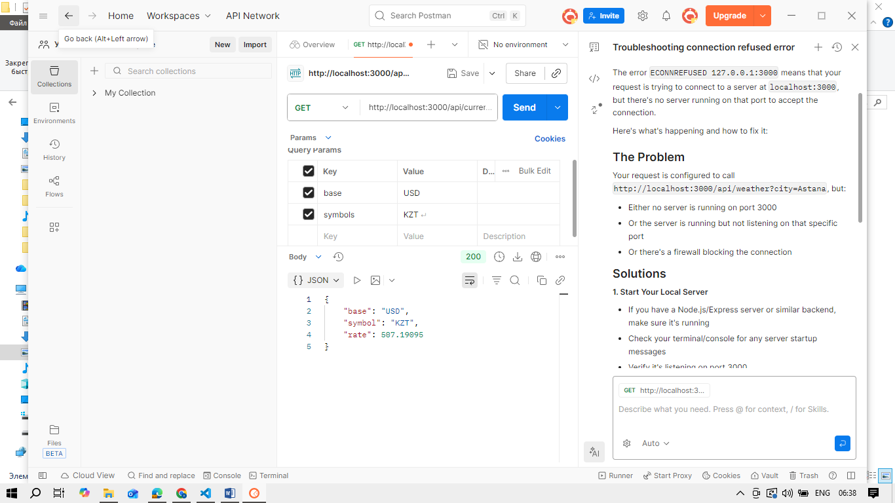
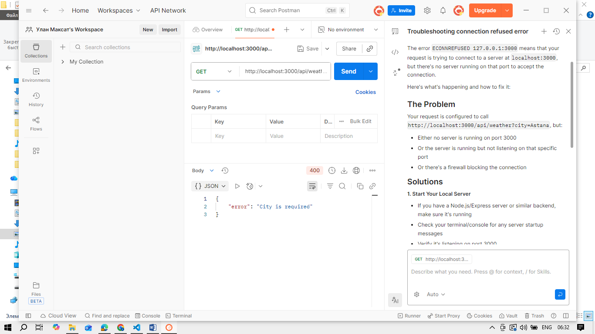
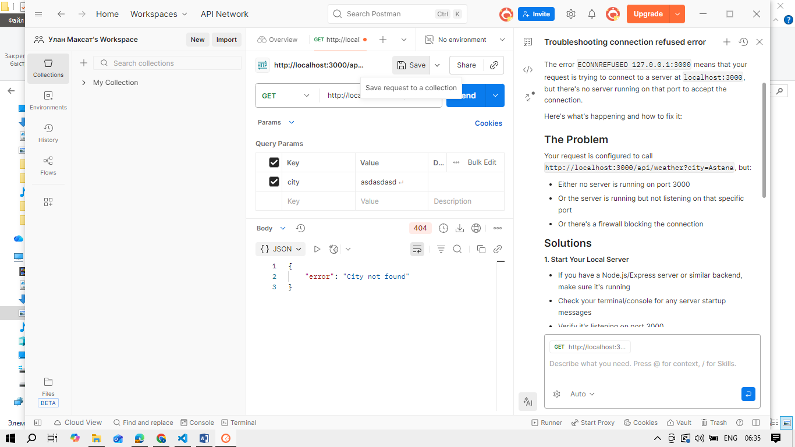
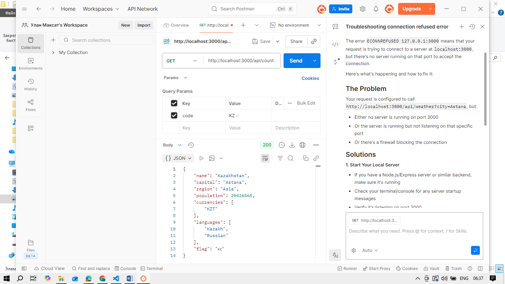

# Weather Atlas — Web Technologies 2 (Backend)

This project was developed as part of the **Web Technologies 2 (Backend)** course.
The application demonstrates working with a Node.js backend, third-party APIs, and a simple frontend interface.

The main idea of the project is to retrieve weather information for a given city and display additional related data such as country information and currency exchange rates


## Technologies Used
* **Node.js**
* **Express.js**
* **dotenv**
* **OpenWeather API**
* **REST Countries API**
* **Exchange Rate API**
* **HTML, CSS, JavaScript**
* **Leaflet (for map visualization)**


## Project Structure

```
web2-a2/
  server/
    server.js
    routes/
    services/
    utils/
    .env
    package.json
  public/
    index.html
    styles.css
    core.js
  README.md
```

* `server/` — backend logic and API routes
* `public/` — frontend files
* `.env` — environment variables (not included in repository)


## Environment Variables

Create a `.env` file inside the `server` folder:

```env
PORT=3000
OPENWEATHER_API_KEY=your_api_key_here
```

> The API key is stored on the server side only and is not exposed to the frontend.


## How to Run the Project

1. Open terminal in the `server` folder
2. Install dependencies:

   ```bash
   npm install
   ```
3. Start the server:

   ```bash
   npm start
   ```
4. Open in browser:

   ```
   http://localhost:3000
   ```


## API Endpoints

### Weather API

```
GET /api/weather?city=Astana
```

Returns:

* city name
* country code
* temperature
* feels like temperature
* humidity
* pressure
* wind speed
* weather description
* coordinates (latitude, longitude)
* rain volume (last 3 hours, if available)

Error cases:

* missing city → 400
* city not found → 404
* external API error → 500


### Country API

```
GET /api/country?code=KZ
```

Returns:

* country name
* capital
* region
* population
* languages
* currencies
* flag


### Currency API

```
GET /api/currency?base=USD&symbols=KZT
```

Returns:

* base currency
* target currency
* exchange rate

## Frontend Features

* City search input
* Weather data display
* Country information snapshot
* Currency exchange rate
* Interactive map with marker
* Error handling for invalid requests
* Responsive layout

All frontend logic is implemented in `core.js`.
HTML files do not contain business logic.


## Postman Testing

The following requests were tested in Postman:

* `/api/weather?city=Astana` → 200
* `/api/weather` → 400
* `/api/weather?city=invalidcity` → 404
* `/api/country?code=KZ` → 200
* `/api/currency?base=USD&symbols=KZT` → 200

Screenshots of Postman responses are included below.

### Weather API — 200 OK

### Weather API — 400 Bad Request

### Weather API — 404 Not Found

### Country API — 200 OK

### Currency API — 200 OK


## Notes

* External APIs are accessed only from the backend
* API keys are securely stored using environment variables
* The map uses OpenStreetMap tiles via Leaflet
* The project focuses on backend logic and API integration rather than complex UI design

## Conclusion

This project demonstrates practical usage of a backend server with third-party APIs, proper environment variable management, and basic frontend interaction.
It follows the requirements of the Web Technologies 2 course.
